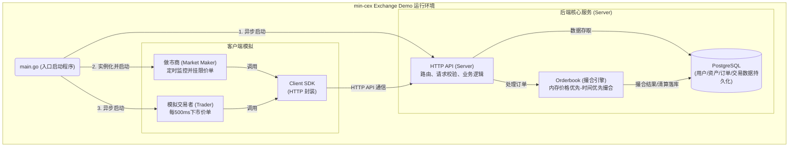
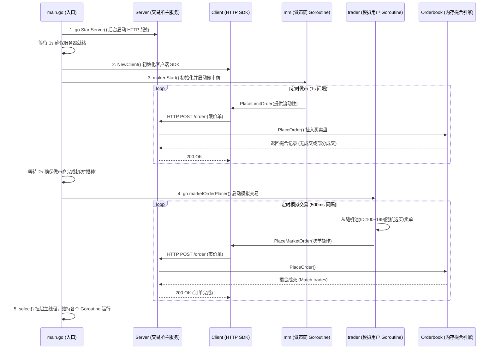

# min-cex 交易所架构与调用链路

本项目模拟了一个最简化的中心化加密货币交易所（CEX）。文档包含了核心的系统架构图和调用链路图。

## 1. 系统架构图

系统主要由三大模块组成：提供流动性的做市商（MM）、模拟真实用户的市价单交易者（Trader），以及核心的后端交易所服务（API层 + 撮合引擎 + 数据库）。

## 2. 调用链路 / 启动与生命周期图

该时序图展示了程序执行 `main()` 时的启动顺序，以及做市商和普通用户的并发模拟交互流：

## 简要说明
* **入口程序**：`main.go` 充当调度者，它依次拉起 Server、建立 Client，接着分别挂载做市商(`mm`)和散户交易模块(`marketOrderPlacer`)。
* **数据流向**：做市商负责给原本空空的撮合引擎（`Orderbook`）建立深度池，随后散户进来根据设定的比例通过市价单“吃掉”这些挂单，从而实现整个闭环 Demo。撮合引擎处理好的明细再经 Server 同步持久化。
